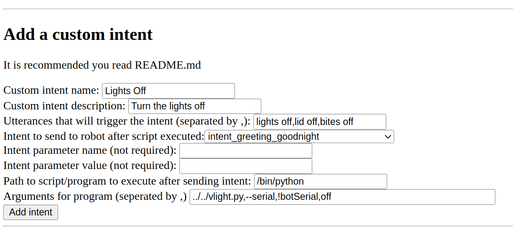
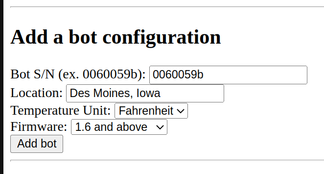

# wire-pod

This repo contains a custom Vector voice server using [chipper](https://github.com/digital-dream-labs/chipper) and [vector-cloud](https://github.com/digital-dream-labs/vector-cloud).

This is the original wire-pod, which was made to be dev-friendly. For one that is easier to setup and use, use [wire-prod-pod](https://www.github.com/kercre123/wire-prod-pod).

## Program Descriptions

`chipper` - Chipper is a program used on Digital Dream Lab's servers which takes in a Vector's voice stream, puts it into a speech-to-text processor, and spits out an intent.

`vector-cloud` - Vector-cloud is the program which runs on Vector himself which uploads the mic stream to a chipper instance. This repo contains a fork of vector-cloud which has been modified to allow for a custom CA cert.

## Documentation

All documentation will soon be moved into the [wiki](https://github.com/kercre123/wire-pod/wiki).

## Configuring, Building, Installing

(This is the original wire-pod, which is designed for OSKR/dev bots and to be dev-friendly. If you want to set up a regular production bot, it is recommended you use [wire-prod-pod](https://www.github.com/kercre123/wire-prod-pod))

### Linux

(Your distribution must have either pacman, dnf, or apt)

```
cd ~
git clone https://github.com/kercre123/wire-pod.git
cd wire-pod
sudo ./setup.sh

# You should be able to just press enter for all of the settings
```

Now install the files created by the script onto the bot:

`sudo ./setup.sh scp <vectorip> <path/to/key>`

Example:

`sudo ./setup.sh scp 192.168.1.150 /home/wire/id_rsa_Vector-R2D2`

If you are on my custom software (WireOS), you do not have to provide an SSH key,

Example:

`sudo ./setup.sh scp 192.168.1.150`

The bot should now be configured to communicate with your server.

To start chipper, run:

```
cd chipper
sudo ./start.sh
```

### Windows

1. Open up Powershell as administrator
	-	Open the start menu, type in Powershell, right click, click "Run as administrator"

2. Enter the following command:

```
wsl --install
```

3. Reboot your computer.

4. After the reboot, Ubuntu should install. Wait for it to finish.

5. The Ubuntu installer should ask for a UNIX username. Enter one. example: `wire`

6. It should then ask for a UNIX password. Make sure you remember this! It will not show any indication that you are typing anything, that is normal.

7. You should now be at an Ubuntu terminal. Leave that open in the background.

8. Open up Powershell as administrator
	-	Open the start menu, type in Powershell, right click, click "Run as administrator"

9. In Powershell, run the following command. When it asks for a confirmation, enter `Y`.

```Set-ExecutionPolicy Bypass```

10. In Powershell, run the following commands:

```
cd ~
curl -o wsl-firewall.ps1 https://keriganc.com/wsl-firewall.ps1
.\wsl-firewall.ps1
```

11. Return to the Ubuntu terminal and follow the Linux instructions for installation.

(if it asks for a password, enter what you entered for the UNIX password earlier)

12. Once that is finished, run the following commands to start the server:

```
cd ~/wire-pod
sudo ./chipper/start.sh
```

(NOTE: WSL does not have systemd, so you will need to run these commands every time you want to start the server. It will not start automatically.

It should now be setup!

#### Update

To update to a newer version of wire-pod, make sure chipper is not running then run:
```
cd ~/wire-pod
sudo git pull
cd chipper
sudo ./start.sh
```
If you see an error, run the command it tells you to run but with `sudo` at the beginning of the command. Then run `sudo ./start.sh` again.

#### Systemd daemon

You can setup a systemd daemon for wire-pod. This allows it to run in the background and it to run automatically at startup.
```
cd ~/wire-pod
sudo ./setup.sh daemon-enable
```
To start the service, either restart your computer or run:

`sudo systemctl start wire-pod`

To see logs, run:

`journalctl -fe | grep start.sh`

If you would like to disable the daemon, run:
```
cd ~/wire-pod
sudo ./setup.sh daemon-disable
```

## Web interface

Chipper hosts a web interface at port 8080. This can be used to create custom intents and to configure specific bots.

To get to it, open a browser and go to `http://serverip:8080`, replacing serverip with the IP address of the machine running the chipper server. If you are running the browser on the machine running chipper, you can go to `http://localhost:8080`

- Custom intents
	- Example: You want to create a custom intent that allows Vector to turn the lights off. The transcribed text that matches to this intent should include "lights off" and other variations like "lid off" for better detection. It will execute a python script located in your user directory called `vlight.py`. It should be launched with the `off` variable because the lights are being turned off. This script turns the lights off and connects to Vector so he says "The lights are off!". You have multiple bots registered with the SDK so a serial number must be specified. After the SDK program is complete, chipper should send `intent_greeting_goodnight`. The following screenshot is a correct configuration for this case. The `Add intent` button would be pressed after everything is put in.
	- 
	- (If `!botSerial` is put into the program arguments, chipper will substitute it for the serial number of the bot that is making a request to it.)
- Bot configurations
	- Example: You have a bot on 1.6 with a serial number of 0060059b; located in Des Moines, Iowa; and you would like to use Fahrenheit for the temperature unit in the weather command. The following screenshot is a correct configuration for that bot. Once that is input, you would press "Add bot". It would then be registered with chipper.
	- 

## Status

OS Support:

- Arch
- Debian/Ubuntu/other APT distros
- Fedora/openSUSE
- Windows under WSL

Architecture support:

- amd64/x86_64
- arm64/aarch64
- armv7l/arm32 (picovoice only)

STT services you can choose from:

- Coqui
	- Coqui is a completely local service which is reasonably accurate and fast.
- Picovoice Leopard
	- Leopard does processing locally but you must sign up for an account at [https://console.picovoice.ai](https://console.picovoice.ai) and put in an API key during setup.sh, so some data is sent to a cloud. It is more accurate and fast though, and supports more hardware.
- VOSK
	- VOSK is open source, resonably accurate, fast enough on a RPi. And it supports multi language! Dual English/Italian intents are supported in this release, but many more languages can be added easily.

Weather providers you can choose from:

- weatherapi.com
  - Offers free developer trial API access, expiring every month
- openweathermap.com
  - Offers free basic API access with 60 calls/minute (max 1,000,000 calls/month) 

  
Things wire-pod has worked on:

- Raspberry Pi 4B+ 4GB RAM with Raspberry Pi OS
- Must be 64-bit OS if using Coqui
- Raspberry Pi 4B+ 4GB RAM with Manjaro 22.04
- Nintendo Switch with L4T Ubuntu
- Desktop with Ryzen 5 3600, 16 GB RAM with Ubuntu 22.04
- Laptop with mobile i7
- Desktop with Xeon X5650
- Android Devices
	- Pixel 4, Note 4, Razer Phone, Oculus Quest 2, OnePlus 7 Pro, Moto G6, Pixel 2
	- [Termux](https://github.com/termux/termux-app) proot-distro: Use Ubuntu, make sure to use a port above 1024 and not the default 443.
	- Linux Deploy: Works stock, just make sure to choose the arch that matches your device in settings. Also use a bigger image size, at least 3 GB.

General notes:

- If you get this error when running chipper, you are using a port that is being taken up by a program already: `panic: runtime error: invalid memory address or nil pointer dereference`
	- Run `./setup.sh` with the 5th and 6th option to change the port, you will need to push files to the bot again.
- If you want to disable logging from the voice processor, set DEGUG_LOGGING in ./chipper/source.sh to `false`.
- You have to speak a little slower than normal for Coqui STT to understand you.

Current implemented actions:

- Good robot
- Bad robot
- Change your eye color
- Change your eye color to <color>
	- blue, purple, teal, green, yellow
- How old are you
- Start exploring ("deploring" works better)
- Go home (or "go to your charger")
- Go to sleep
- Good morning
- Good night
- What time is it
- Goodbye
- Happy new year
- Happy holidays
- Hello
- Sign in alexa
- Sign out alexa
- I love you
- Move forward
- Turn left
- Turn right
- Roll your cube
- Pop a wheelie
- Fistbump
- Blackjack (say yes/no instead of hit/stand)
- Yes (affirmative)
- No (negative)
- What's my name
- Take a photo
- Take a photo of me
- What's the weather
	- Requires API setup
- What's the weather in <location>
	- Requires API setup
- What's the weather forecast / What's the weather <this afternoon|tonight|tomorrow|the day after tomorrow>
	- Requires openweathermap API setup
- Im sorry
- Back up
- Come here
- Volume down
- Be quiet
- Volume up
- Look at me
- Set the volume to <volume>
	- High, medium high, medium, medium low, low
- Shut up
- My name is <name>
- I have a question
	- Requires API setup
- Set a timer for <time> seconds
- Set a timer for <time> minutes
- Check the timer
- Stop the timer
- Dance
- Pick up the cube
- Fetch the cube
- Find the cube
- Do a trick
- Record a message for <name>
	- Enable `Messaging` feature in webViz Features tab
- Play a message for <name>
	- Enable `Messaging` feature in webViz Features tab

## Credits

- [Digital Dream Labs](https://github.com/digital-dream-labs) for saving Vector and for open sourcing chipper which made this possible
- [dietb](https://github.com/dietb) for rewriting chipper and giving tips
- [GitHub Copilot](https://copilot.github.com/) for being awesome
